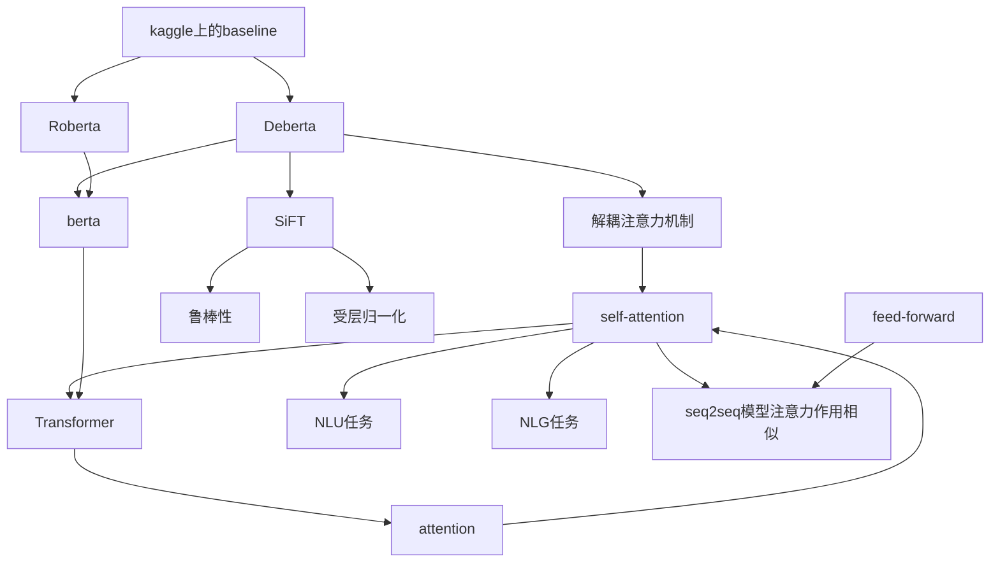

# nlp-kaggle
 nlp学习, 做kaggle-[U.S. Patent Phrase to Phrase Matching](https://www.kaggle.com/competitions/us-patent-phrase-to-phrase-matching)

## 第一步: 看百度网盘nlp学习视频

```
链接：https://pan.baidu.com/s/1NmfLQutHqZ5gEsxChTJ6Sw?pwd=auv0 
提取码：auv0 
--来自百度网盘超级会员V2的分享
```


1. 这些视频着实有些老了，代码也是——好多API都对不上
2. 后面看了自己那本《TensorFlow深度学习算法原理与编程实战》
3. 又看了李沐[《一起动手做深度学习》](https://zh.d2l.ai/)——文件都放在d2l文件夹了


## 第二步：看baseline

你可以去看看那个baseline https://www.kaggle.com/code/renokan/2-deberta-1-roberta-analysis-and-using

### 自己colab代码理解

https://colab.research.google.com/drive/1cFgOJL6pGF7kGEV6lUXM-EPy3u_yqdJa#scrollTo=aCUvLUEeVxB8

### 看文献

发现代码一层套一层，有很多都不理解，于是去查阅文献

**过程：**



### 学习思路

我看了一圈文献之后简单理一下思维路线，我觉得 

1. 先去看有**李沐**视频讲解的*seq2seq模型，注意力模型*
2. Transformer模型
3. berta模型，Roberta，Deberta


## 参考文献

[1] BERT - 搜索结果 - 知乎[EB/OL]. [2022-06-15]. https://www.zhihu.com/search?type=content&q=BERT.


[2] DEVLIN J, CHANG M W, LEE K, 等. BERT: Pre-training of Deep Bidirectional Transformers for Language Understanding: arXiv:1810.04805[R/OL]. arXiv, 2019[2022-06-15]. http://arxiv.org/abs/1810.04805. DOI:[10.48550/arXiv.1810.04805](https://doi.org/10.48550/arXiv.1810.04805).


[3] HE P, LIU X, GAO J, 等. DeBERTa: Decoding-enhanced BERT with Disentangled Attention: arXiv:2006.03654[R/OL]. arXiv, 2021[2022-06-15]. http://arxiv.org/abs/2006.03654. DOI:[10.48550/arXiv.2006.03654](https://doi.org/10.48550/arXiv.2006.03654).


[4] DEBERTA：解耦注意力的解码增强型BERT[EB/OL]//知乎专栏. [2022-06-15]. https://zhuanlan.zhihu.com/p/348704980.


[5] ICLR2021 | 微软DeBERTa：SuperGLUE上的王者 - 知乎[EB/OL]. [2022-06-15]. https://zhuanlan.zhihu.com/p/344649850.


[6] RoBERTa 详解 - 知乎[EB/OL]. [2022-06-15]. https://zhuanlan.zhihu.com/p/103205929.


[7] LIU Y, OTT M, GOYAL N, 等. RoBERTa: A Robustly Optimized BERT Pretraining Approach: arXiv:1907.11692[R/OL]. arXiv, 2019[2022-06-15]. http://arxiv.org/abs/1907.11692. DOI:[10.48550/arXiv.1907.11692](https://doi.org/10.48550/arXiv.1907.11692).


[8] SuperGLUE Benchmark[EB/OL]//SuperGLUE Benchmark. [2022-06-15]. https://super.gluebenchmark.com/.


[9] 沐张. 《动手学深度学习》 — 动手学深度学习 2.0.0-beta0 documentation[EB/OL]. [2022-06-11]. https://zh.d2l.ai/.


[10] 图解Transformer（完整版）_龙心尘的博客-CSDN博客_transformer[EB/OL]. [2022-06-15]. https://blog.csdn.net/longxinchen_ml/article/details/86533005.


[11] 跟李沐学AI的个人空间_哔哩哔哩_bilibili[EB/OL]. [2022-06-11]. https://space.bilibili.com/1567748478.
